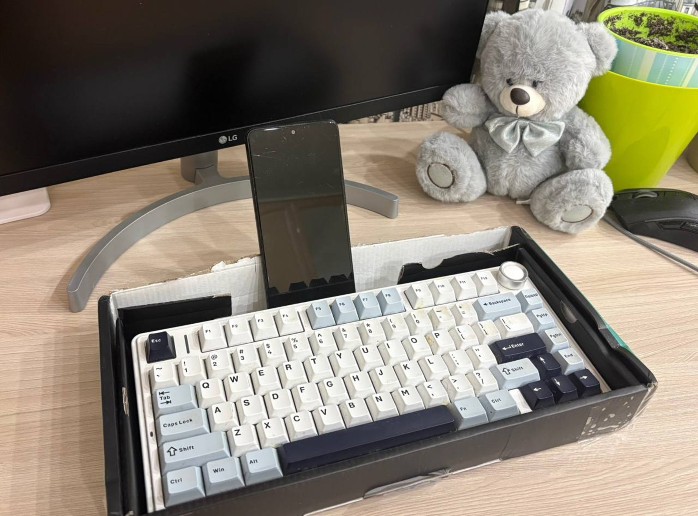
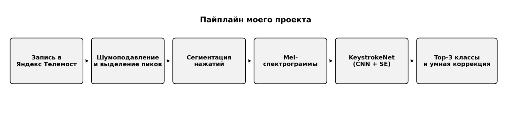
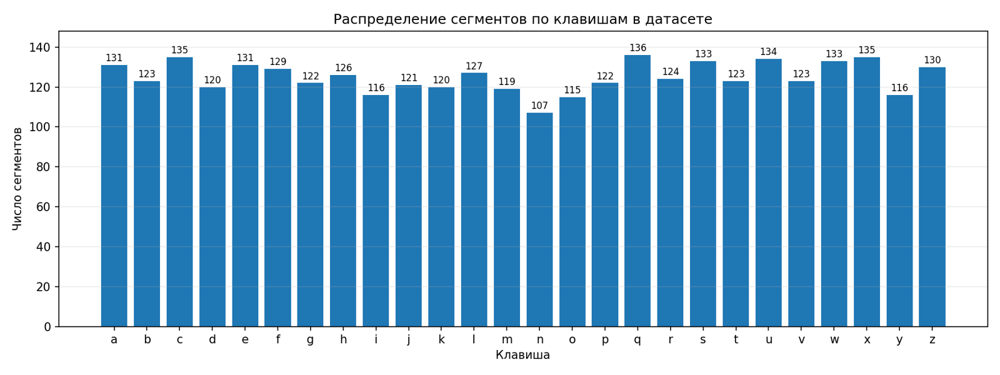
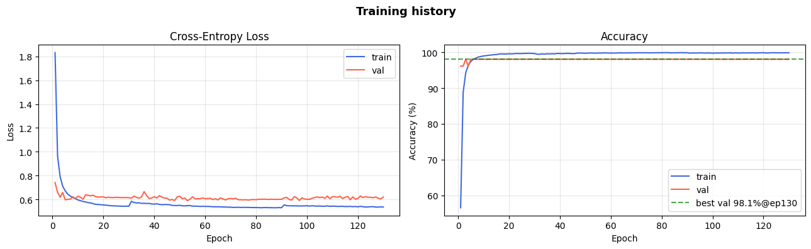
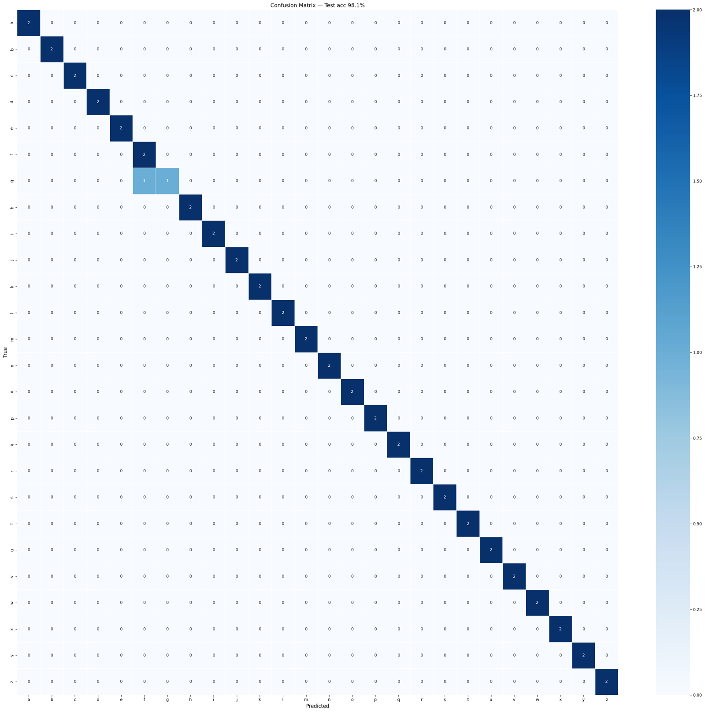
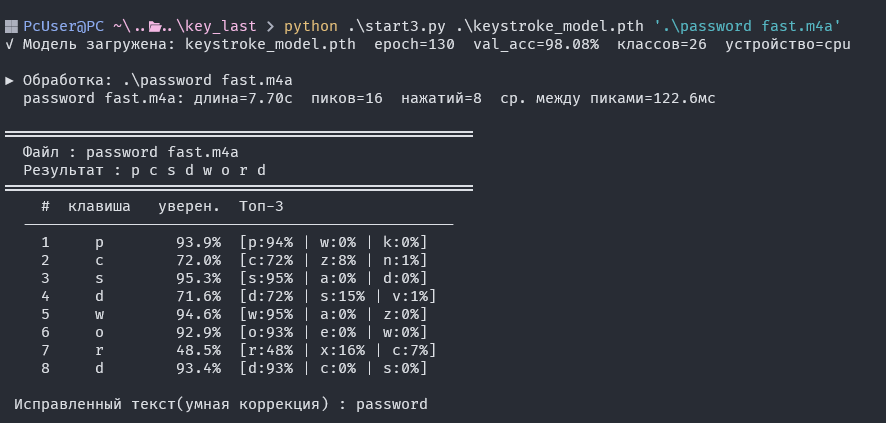
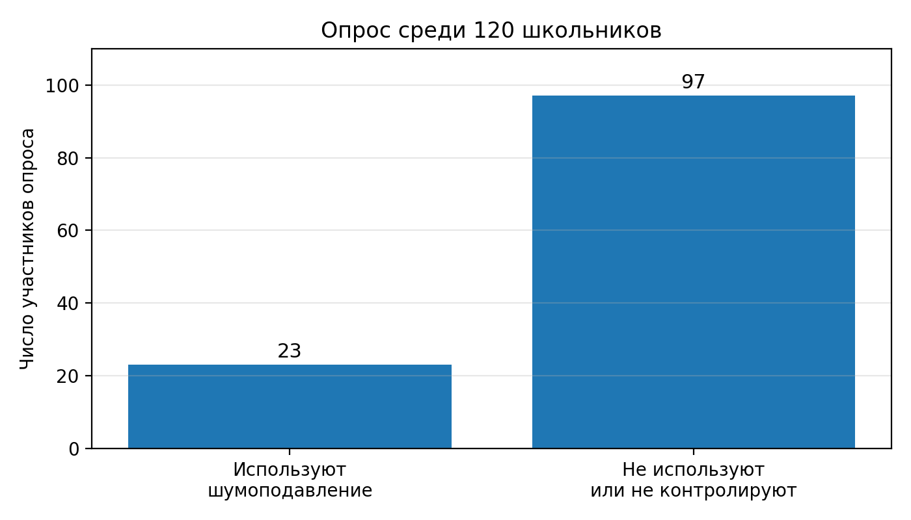

# Acoustic Keyboard Side-Channel Attack in a Real MAX Call


Кратко оформленный GitHub-репозиторий учебного проекта по информационной безопасности.

## Идея проекта
Проект показывает, что звук механической клавиатуры может выступать побочным каналом утечки данных даже в реальном онлайн-звонке. В качестве proof-of-concept используется собственный датасет, собранный во время одного звонка MAX, и модель **KeystrokeNet**, классифицирующая нажатия клавиш по mel-спектрограммам.

## Ключевые результаты
- **26 классов**: буквы латинского алфавита `a-z`
- **3251 сегмент** после выделения нажатий
- **Представление признаков**: mel-спектрограммы `128×52`
- **Модель**: CNN `KeystrokeNet` с residual- и SE-блоками
- **Лучшая validation accuracy**: `98.08%`
- **Test accuracy**: `98.08%`
- **Контрольный тест**: слово `password` восстановлено после постобработки

## Фото и визуальные материалы
### Стенд


### Пайплайн


### Распределение сегментов по клавишам


### Кривые обучения


### Матрица ошибок


### Контрольный тест на слове password


### Опрос по использованию шумоподавления


## Структура репозитория
```text
.
├── README.md
├── DISCLAIMER.md
├── requirements.txt
├── .gitignore
├── assets/
│   ├── 01_stand.jpg
│   ├── 02_pipeline.png
│   ├── 03_class_distribution.png
│   ├── 04_training_curves.png
│   ├── 05_confusion_matrix.png
│   ├── 06_password_demo.png
│   └── 07_survey.png
├── docs/
│   └── poyasnitelnaya_zapiska_vsosh_gost_MAX.docx
└── notebooks/
    └── acoustic_keylogger_colab.ipynb
```

## Быстрый старт
```bash
git clone <your-repo-url>
cd acoustic-keylogger-github
pip install -r requirements.txt
```

После этого можно открыть ноутбук `notebooks/acoustic_keylogger_colab.ipynb` в Google Colab и подставить свои пути к данным.

## Технологии
- Python
- PyTorch
- Librosa
- Noisereduce
- Scikit-learn
- Google Colab / NVIDIA Tesla T4

## Важно
Проект публикуется **только в учебных и исследовательских целях**. Его задача — показать риск акустических утечек и помочь формулировать меры защиты, а не использовать подобные методы против чужих устройств или аккаунтов. Я не несу ответсвенность если проект будет применяться в незаконныхц целях.
